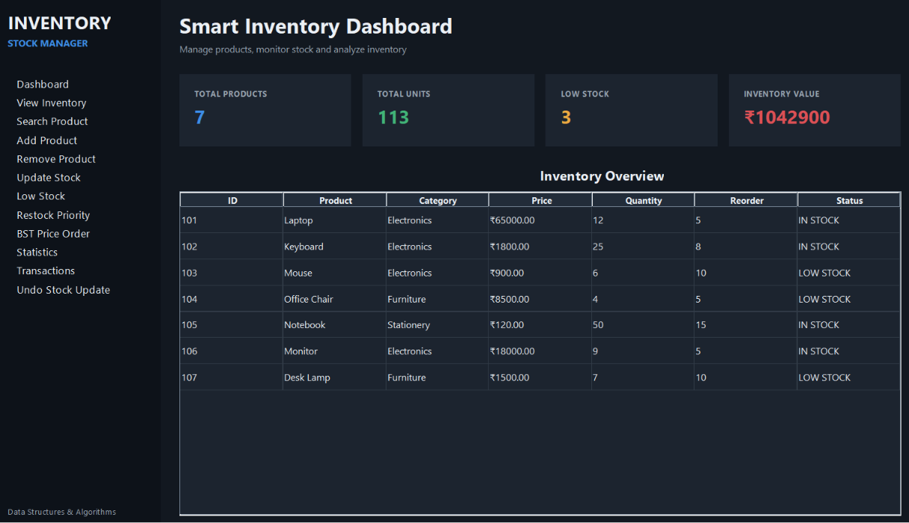
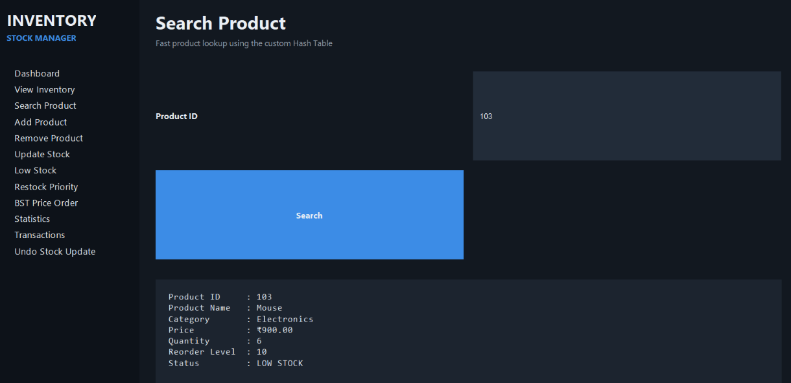
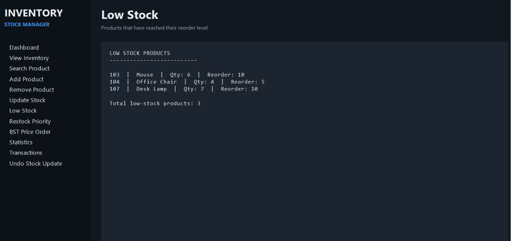
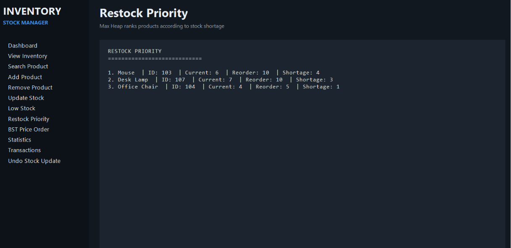

# Smart Inventory & Stock Manager

A Java Swing-based desktop application for managing products, monitoring inventory levels, tracking stock updates, and analyzing stock conditions using Data Structures and Algorithms.

## Overview

Smart Inventory & Stock Manager is a desktop inventory management system designed to demonstrate how Data Structures and Algorithms can be applied to a real-world stock management problem.

The application provides a modern dashboard where users can manage products, search inventory, identify low-stock products, prioritize restocking, sort products, view price ordering, track transactions, and undo stock updates.

The project is implemented in Java with a graphical user interface using Java Swing.

## Features

- Dashboard with inventory statistics
- Add new products
- Remove products
- Update product stock
- Search products by Product ID
- Detect low-stock products
- Restock priority ranking
- Sort products by name
- Sort products by quantity
- Sort products by price
- BST-based price ordering
- Transaction history
- Undo previous stock updates
- Inventory statistics
- View complete inventory
- Preloaded sample inventory
- Input validation
- Windows desktop application

## Data Structures & Algorithms Used

### Hash Table

A custom Hash Table is used for fast product lookup using Product ID.

**Purpose:**
- Fast product searching
- Efficient product identification
- Average O(1) lookup time

### Binary Search Tree

A Binary Search Tree is used to organize products according to their price.

**Purpose:**
- Maintain price-based ordering
- Perform ordered traversal
- Demonstrate BST operations

### Queue

A custom Queue is used for managing inventory-related transactions.

**Purpose:**
- Maintain FIFO (First In, First Out) order
- Process inventory transactions sequentially

### Stack

A custom Stack is used for stock update history.

**Purpose:**
- Store previous stock updates
- Implement the Undo Stock Update operation
- Follow LIFO (Last In, First Out)

### Max Heap

A Max Heap is included for restock priority management.

Products with a greater stock shortage can receive higher priority for restocking.

**Purpose:**
- Prioritize products requiring urgent restocking
- Demonstrate heap-based priority management

### Sorting

Sorting techniques are used to organize inventory based on:

- Product Name
- Quantity
- Price

## How the Application Works

The application maintains product information such as:

- Product ID
- Product Name
- Category
- Price
- Quantity
- Reorder Level

When a product is added, its information is maintained by the inventory data structures.

When a user searches for a product, the custom Hash Table provides efficient lookup using the Product ID.

The Binary Search Tree organizes products according to price, allowing the application to display products in price order.

When stock is updated, the previous state is stored in a Stack so that the operation can be reversed using the Undo feature.

Products that reach or fall below their reorder level are detected as low-stock products.

Restock Priority analyzes the stock shortage of low-stock products and ranks them according to urgency.

## Dashboard

The dashboard provides an overview of the inventory including:

- Total Products
- Total Units
- Low Stock Products
- Total Inventory Value
- Complete Inventory Table

## Screenshots

### Main Dashboard

### Product Search

### Low Stock Detection

### Restock Priority

## Technologies Used

- Java
- Java Swing
- Object-Oriented Programming
- Data Structures
- Algorithms
- Custom Hash Table
- Binary Search Tree
- Queue
- Stack
- Max Heap
- Sorting
- Java jpackage
- Windows Desktop Application

## How to Run

### Windows Desktop Application

The project includes a packaged Windows application created using Java `jpackage`.

To run the application:

1. Open the packaged application folder.
2. Open the `SmartInventoryManager` application directory.
3. Double-click `SmartInventoryManager.exe`.

The packaged application contains the required Java runtime for launching the application.

### Run from Source

The project can also be run from the Java source code using a Java development environment such as VS Code.

Open `SmartInventoryManager.java` and run the Java application.

The project uses standard Java and Java Swing and does not require external libraries.

---

## 👨‍💻 Author

**Sujal Patil**

